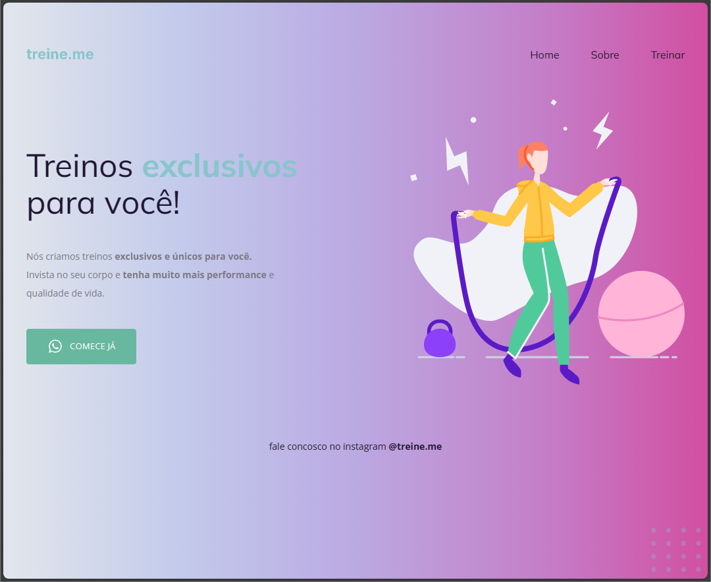

<h1 align="center">👨‍💻 Treine.me </h1>

## 💻 Sobre 
O Projeto **Treine.me** cria treinos customizados para os usuários, ele foi elaborado durante a **Formação Explorer da Rocketseat**.

## 🚀 Tecnologias
Ferramentas utilizadas durante o projeto:

